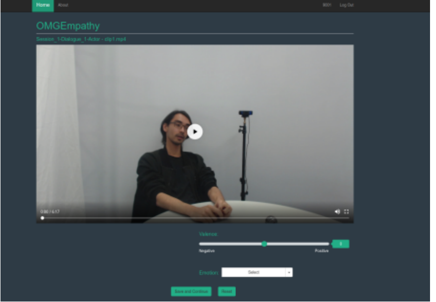

# OMG Empathy Dataset

The ability to perceive, understand and respond to social interactions in a human-like manner is one of the most desired capabilities in artificial agents, particularly social robots. These skills are highly complex and require focus on several different aspects of research, including affective understanding. An agent which is able to recognize, understand and, most importantly, adapt to different human affective behaviors can increase its own social capabilities by being able to interact and communicate in a natural way.

The One-Minute Gradual Empathy datasets (OMG-Empathy) contain multi-modal recordings of different individuals discussing predefined topics. One of them, the actor, shares a story about themselves while the other, the listener, reacts to it emotionally. We annotated each interaction based on the listener's own assessment on how they felt while the interaction was taking place.

**What do we mean with Empathy?**

The OMG-Empathy corpus is composed of recordings of two individuals talking to each other about a certain topic. One of the individuals is an actor who leads a semi-scripted conversation with a listener. The actors tells stories about what happened to them recently, and we recorded the reactions of the listener to these stories over time, which can contain short interactions.

We created a series of eight topics that the actor talked about, each of them related to one or more emotional state:

- Story 1 - A childhood friend.
- Story 2 - I started a band!
- Story 3 - My relation with my dog.
- Story 4 - I had a bad flight experience.
- Story 5 - I cheated on an exam when I was younger.
- Story 6 - I had an adventurous traveling experience.
- Story 7 - I won a martial arts challenge.
- Story 8 - I ate a very bad food.

The actor was free and encouraged to improvise on each of these topics, so that we recorded a natural conversation scenario, but the actor was instructed to maintain the control over the conversation. This way, we guaranteed that the recorded interaction were not one-sided, and at the same time that the listener did not overtake the direction of the conversation.

We recorded the audio and visual data of both the actor and listener for each interaction. Immediately after each session, we asked the listeners to watch the interactions on a computer screen and use a joystick to annotate how they felt in terms of valence using a continuous scale ranging from positive to negative values. The use of the joystick allowed for continuous and gradual tracking of annotations which are temporally related to the interaction scenario.

We used a total of four different actors, each one of them taking part in the conversation with two different topics. This way we collected different reaction levels from different listeners for the same actor. We had a total of 10 subjects, each one taking part in all the eight topics. This gave us 80 different interaction videos. Each video had an average of 5 minutes and 12 seconds, providing us with 415 minutes (around 7 hours) of recordings.

**Data Annotations**
 
 

 We provide here four sets of annotations:
 - SelfAnnotation - The traditional and standard annotation set. After every story scenario, the listeners were asked to annotated, in a continuous valence scale [0,1] how the story impacted them. For that, they re-watched the video of the scenario, and annotated their valence using a joystick. This allows for a continuous annotation of valence.
 - Listener (Third Party) - Once all the story scenarios were collected, we asked a third party viewer to annotate all the perceived valence, in a scale of [0,1] of the listener, by watching the videos and using a joystick for continual annotation.
 - Speaker (Third Party) - We repeat the same annotation protocol for the Speaker, and provide a valence annotation for the perceived expressions of the speaker in an interval of [0,1]
 - Transcriptions - We provide a manually annotated and curated transcription of all the videos.

**Evaluation Protocol**

As a standard evaluation task, we created a pre-defined set of training, validation and testing samples. We separate our samples based on each story: 4 stories for training, 1 for validation and 3 for testing. Each story sample is composed of 10 videos with interactions, one for each listener. Although using the same training, validation and testing data split, we propose two tracks which will measure different aspects of the self-assessed empathy:

The **Personalized Empathy track**, where each team must predict the empathy of a specific person. We will evaluate the ability of proposed models to learn the empathic behavior of each of the subjects over a newly perceived story. We encourage the teams to develop models which take into consideration the individual behavior of each subject in the training data.

The **Generalized Empathy track**, where the teams must predict the general behavior of all the participants over each story. We will measure the performance of the proposed models to learn a general empathic measure for each of the stories individually. We encourage the proposed models to take into consideration the aggregated behavior of all the participants for each story, and to generalize this behavior in a newly perceived story.

**OMG Empathy Challenge**
 In 2019, we organized a challenge to foster the development of community-based solutions for each of the proposed tracks.
 
More information, please visit the [Challenge Website](https://github.com/knowledgetechnologyuhh/OMGEmpathyChallenge)

**Dataset Structure**

The dataset is separated into .mp4 videos. Each video name contain the story and subject information. The annotations follow the same name structure. Each .csv contain a header ("valence") and each row of the file represents the valence of one frame of the video.

**Scripts**

We provide the following scripts:

- OMG_empathy_extract_audio.py: a script used to extract an audio file (in .wav format) for all the videos of the dataset.

- OMG_empathy_extract_faces.py: a script used to extract the faces (from both actors and subjects) for all the videos of the dataset.

- calculateCCC.py: a script used to calculate the CCC of the output of a model and the validation set for both tracks.

To calculate the CCC for both tracks, the script takes as arguments two folders: one with the validation .csv files and one with the model's .csv files. Be aware that the folders must contain the same amount of files and they must have he same file name - following the same structure as the annotations: Subject_X_Story_X.csv. Each file must contain a header ("valence") and each row of the file must be the valence output for each frame of the video.

**Access do the dataset**

To have full access to this corpus, please send an e-mail with your name, affiliation and research summary to: pablovin @ gmail.com

**License**

This corpus is distributed under the Creative Commons CC BY-NC-SA 3.0 DE license. If you use this corpus, you have to agree with the following itens:

- To cite our reference in any of your papers that make any use of the database. 
- The references are provided at the end of this page.
- To use the corpus for research purpose only.
- To not provide the corpus to any second parties.
- To delete the dataset as soon as you finish using it.

**Authors**
Pablo Barros, University of Hamburg, Germany  
Nikhil Churamani, University of Cambridge, United Kingdom  
Angelica Lim, Simon Fraser University, Canada  
Stefan Wermter, Hamburg University, Germany  

We also whant to thank all the help on the data annotations and transcripts from the students and staff of the University of Pernambuco, in Brazil. An effort led by Leandro Honorato (Instituto Federal - Paraiba).

**Reference paper**

 - - Barros, P., Churamani, N., Lim, A., & Wermter, S. (2019, September). The omg-empathy dataset: Evaluating the impact of affective behavior in storytelling. In 2019 8th International Conference on Affective Computing and Intelligent Interaction (ACII) (pp. 1-7). IEEE. [Paper](https://arxiv.org/abs/1908.11706)
